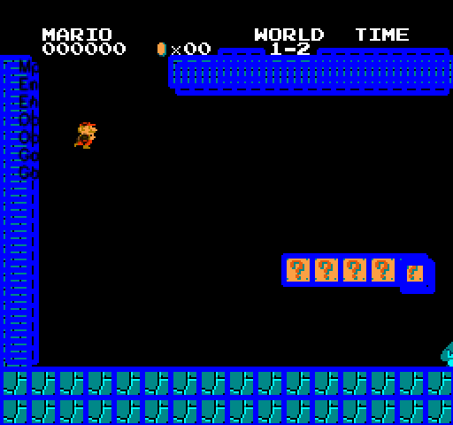

<p align="center">
  <h1 align="center">Vectorised Epsilon-Greedy RL in Super Mario Bros</h1>
</p>

<p align="center">
  
</p>

This project demonstrates a lightweight reinforcement learning agent for Super Mario Bros. It uses simple sprite detection and tracks objects in the scene with basic vector maths to aid with decision making. The agent also tracks areas of repeated failure and increases exploration near those coordinates. The best-performing episode of the run is saved here. With the global best run being displayed at github.com/Sylforen

---


<p align="center">
  <h1 align="center">Getting Started</h1>
</p>

<p align="center">
  <h2 align="center">Clone the repo</h2>
</p>

```bash
git clone https://github.com/Sylforen/mario-cv.git
cd mario-cv/
```

Install dependencies:

```bash
pip install -r requirements.txt
```

Start training:

```bash
python main.py --episodes 50 --enemy_factor 0.95 --gap_factor 0.9
```

Press q to close the display window at any time.

<p align="center">
  <h2 align="center">Docker</h2>
</p>

```bash
docker build -t mario-ml .
```

```bash
docker run --gpus all -it --rm -v "$PWD":/app mario-ml
```
